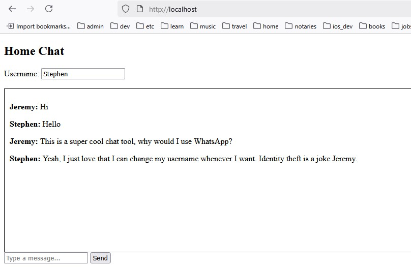

# Homechat2
Homechat2 is a very simple chat application for your home.
It really doesn't have any features you would expect a chat system to have, but something works.
This is a toy project for me to get an application to run on docker/kubernetes.
Architecture:
- Static html/javascript web page served by nginx
- Java spring boot backend broadcasting messages to every other connected user via websockets

